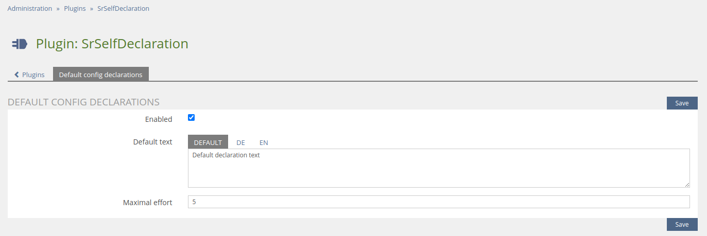
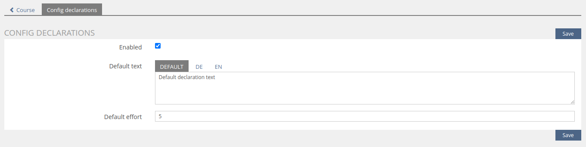
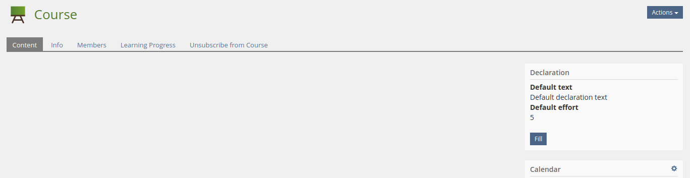
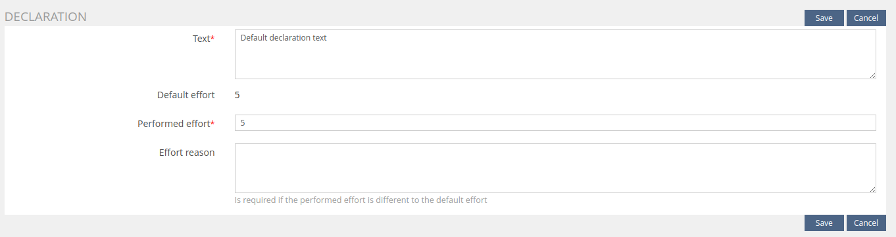
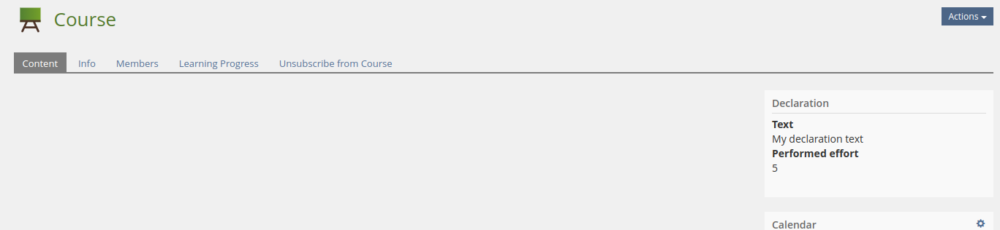
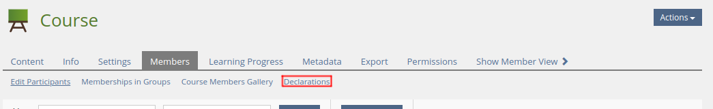
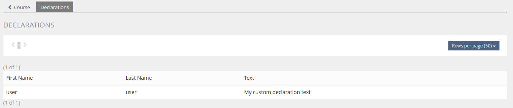

<!-- Autogenerated from composer.json - All changes will be overridden if generated again! -->

# SrSelfDeclaration ILIAS Plugin

Declaration of object members

This is an OpenSource project by studer + raimann ag, CH-Burgdorf (https://studer-raimann.ch)

This project is licensed under the GPL-3.0-only license

## Requirements

* ILIAS 5.4.0 - 6.999
* PHP >=7.0

## Installation

Start at your ILIAS root directory

```bash
mkdir -p Customizing/global/plugins/Services/UIComponent/UserInterfaceHook
cd Customizing/global/plugins/Services/UIComponent/UserInterfaceHook
git clone https://github.com/fluxfw/SrSelfDeclaration.git SrSelfDeclaration
```

Update, activate and config the plugin in the ILIAS Plugin Administration

## Description

Current only courses are supported

### Config

You can configure it global for all objects (new) and adjust it per object if needed

#### Global



#### Object

##### Tab


##### Form



### Declaration block

Object members, with read permission only, can set declaration once

#### Before fill



#### Form



#### After fill



### Declarations

The declarations of object can be viewed from object administrators

#### Tab



#### Table



## Adjustment suggestions

You can report bugs or suggestions at https://plugins.studer-raimann.ch/goto.php?target=uihk_srsu_PLSELDEC

There is no guarantee this can be fixed or implemented

## ILIAS Plugin SLA

We love and live the philosophy of Open Source Software! Most of our developments, which we develop on behalf of customers or on our own account, are publicly available free of charge to all interested parties at https://github.com/studer-raimann.

Do you use one of our plugins professionally? Secure the timely availability of this plugin for the upcoming ILIAS versions via SLA. Please inform yourself under https://studer-raimann.ch/produkte/ilias-plugins/plugin-sla.

Please note that we only guarantee support and release maintenance for institutions that sign a SLA.
